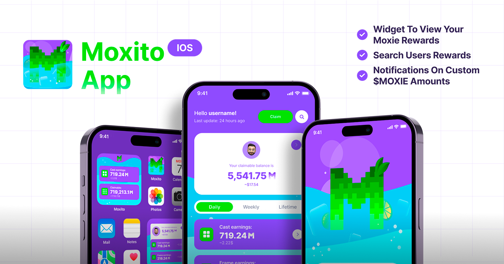

# Moxito iOS App

Moxito is an iOS application that integrates with Farcaster's social protocol to track and manage Moxie rewards. The app showcases modern iOS development practices, SwiftUI implementation, and robust architecture patterns.

## Why Moxito?
Moxito was born in Farcaster, a social platform where [Moxie](https://moxie.xyz/) started. I participated in a Hackathon and won second prize and a Retro Grant placing as a finalist. 

Moxito started as a convenience app to track $MOXIE rewards, leveraging the Subgraphs and APIs provided by [Moxie](https://developer.moxie.xyz/). The following image shows an iOS widget that shows "Daily" and "Claimable" tokens.

Moxito evolved to be a fitness and health app, promoting and rewarding good healthy habits.
Users get rewards for walking, running, and doing any physical activity. HealthKit is used to fetch the health data and an algorithm would calculate the rewards based on effort (steps, calories burned, distance, heart rate, etc.)

## 📱 Screenshots

## 🛠 Development Setup

1. Clone the repository
2. Open `fc-poc-wf.xcworkspace` in Xcode
3. Select the `Moxito-DEBUG` scheme
4. Run the app on a simulator or connected device

## 📦 Dependencies

- Sentry for error tracking
- MoxieLib for core functionality
- MoxitoLib for additional features

## 🌟 Features

- **Farcaster Authentication**: Secure sign-in using Farcaster credentials
- **Real-time Moxie Tracking**: Monitor your Moxie rewards and statistics
- **HealthKit Integration**: Track steps and health metrics
- **Background Updates**: Automatic refresh of Moxie data
- **Push Notifications**: Customizable alerts for rewards and milestones
- **Secure Storage**: Keychain integration for sensitive data
- **Widget Support**: Home screen widgets for quick stats

## 🏗 Architecture & Technical Stack

### Core Technologies
- SwiftUI for modern UI development
- Combine for reactive programming
- Swift concurrency (async/await)
- HealthKit integration
- Background Tasks framework
- Keychain Services
- UserDefaults for persistence
- Sentry for error tracking

### Design Patterns
- MVVM Architecture
- Protocol-oriented programming
- Dependency injection
- Actor-based concurrency
- Repository pattern for data management

### Diagram

## 📱 Key Components

### Authentication
The app implements a secure authentication flow using `ASWebAuthenticationSession` and Sign in with Farcaster login.

### Data Management
Robust data handling with protocol-based services:

- `MoxitoClient`: Handles Farcaster authentication and data fetching
- `HealthKitService`: Manages health data integration
- `StepCountViewModel`: Centralizes step count data and calculations

### Background Processing
Implements sophisticated background task handling for data updates:

- Background tasks for data synchronization
- Background processing of health data
- Background processing of step count data

## 🔒 Security Features

- Secure credential storage using Keychain
- URL scheme validation for deep links
- Error handling with Sentry integration
- Encrypted data persistence

## 🎯 Code Quality

- SwiftLint integration for code consistency
- Comprehensive error handling
- Unit tests
- Documentation and code comments
- Type-safe implementations

## 📊 Performance Optimizations

- Efficient caching mechanisms
- Background task optimization
- Memory management best practices
- Network request batching

## 🤝 Team

Design made by Harios:
[Warpcast](https://warpcast.com/harios)

Founder, coding, development by myself (Christian Leovido):
[Warpcast](https://warpcast.com/leovido.eth)

## Contributing

We welcome contributions! Please open an issue or submit a pull request.

## 👥 Contributing

Contributions are welcome! Please read our [Contributing Guidelines](CONTRIBUTING.md) for details on our code of conduct and the process for submitting pull requests.

## 📄 License

This project is licensed under the MIT License - see the [LICENSE](LICENSE) file for details.

## 🔗 Links

- [Website](https://moxito.xyz)
- [Warpcast](https://warpcast.com/moxito)

## 📫 Contact
For any inquiries, please open an issue or contact me on [Warpcast](https://warpcast.com/leovido.eth).
